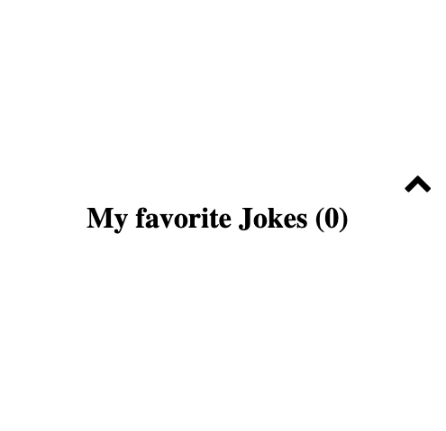

# Procesverslag

**Mijn naam is** -Esther Willems-

**En dit is mijn werk** [opdracht 1](opdracht1/index.html) en [opdracht 2](opdracht2/index.html)

<!-- Markdown cheat cheet: [Hulp bij het schrijven van Markdown](https://github.com/adam-p/markdown-here/wiki/Markdown-Cheatsheet). Nb. de standaardstructuur en de spartaanse opmaak zijn helemaal prima. Het gaat om de inhoud van je procesverslag. Besteedt de tijd voor pracht en praal aan je website. -->

## Bronnenlijst opdracht 1

1.  Ogle, J. (2020, 14 augustus). Positioning Elements on the Web. Thoughtbot. <https://thoughtbot.com/blog/positioning#position>
2.  McDonalds Logo In 2 HTML Elements. (z.d.). jstutorial.medium.com. Geraadpleegd op 6 mei 2021, van <https://jstutorial.medium.com/mcdonalds-logo-in-2-html-elements-second-element-is-not-the-second-arch-11389ca9f0a>
3.  CSS: nth-of-type en nth-child. (z.d.). calaris.nl. Geraadpleegd op 3 mei 2021, van <https://www.calaris.nl/index.php/tips/html-en-css/43-css-nth-of-type-en-nth-child>
4.  CSS en elementen - werken met lagen. (z.d.). handleidinghtml.nl. Geraadpleegd op 2 mei 2021, van <https://www.handleidinghtml.nl/css/css-elementen/css-elementen10.html>
5.  McDonald’s Colors. (z.d.). McDonald’s Colors. Geraadpleegd op 4 mei 2021, van <https://usbrandcolors.com/mcdonalds-colors/>
6.  <https://bennettfeely.com/clippy/>
7.  Android logo pure css. (z.d.). codepen.io. Geraadpleegd op 1 mei 2021, van <https://codepen.io/tamery/pen/zoOmRW?editors=1100>
8.  css animation rotate and translate doesn’t work together [duplicate]. (z.d.). stackoverflow.com. Geraadpleegd op 1 mei 2021, van <https://stackoverflow.com/questions/36455370/css-animation-rotate-and-translate-doesnt-work-together>

## Bronnenlijst opdracht 2

1.  Create a dark light mode switch with css. (z.d.). dev.to. Geraadpleegd op 31 mei 2021, van <https://dev.to/ananyaneogi/create-a-dark-light-mode-switch-with-css-variables-34l8>
2.  How to toggle dark mode. (z.d.). w3Schools.com. Geraadpleegd op 31 mei 2021, van <https://www.w3schools.com/howto/howto_js_toggle_dark_mode.asp>
3.  API icanhazdadjoke. (z.d.). <https://icanhazdadjoke.com/api>. Geraadpleegd op 28 mei 2021, van <https://icanhazdadjoke.com/api>
4.  clonenode. (z.d.). w3schools.com. Geraadpleegd op 5 juni 2021, van <https://www.w3schools.com/jsref/met_node_clonenode.asp>
5.  removing element with plain js. (z.d.). Catalin.red. Geraadpleegd op 6 juni 2021, van <https://catalin.red/removing-an-element-with-plain-javascript-remove-method/>
6.  how to disable button js. (z.d.). flaviocopes.com. Geraadpleegd op 2 juni 2021, van <https://flaviocopes.com/how-to-disable-button-javascript/>
7.  build a random joke generator with js. (z.d.). thecodingpie.com. Geraadpleegd op 26 mei 2021, van <https://thecodingpie.com/post/build-a-random-joke-generator-with-javascript-and-html>
8.  pen. (z.d.). Codepen.io. Geraadpleegd op 25 mei 2021, van <https://codepen.io/sambhavG99/pen/YzyzBWK?editors=1100>
9.  pen. (z.d.). Codepen.io. Geraadpleegd op 25 mei 2021, van <https://codepen.io/pebutler3/pen/Oydedw>
10. how to fix mediaquerry working. (z.d.). fixrunner.com. Geraadpleegd op 25 mei 2021, van <https://www.fixrunner.com/how-to-fix-media-query-not-working-in-wordpress/>
11. keycode js. (z.d.). keycode.info. Geraadpleegd op 5 juni 2021, van <https://keycode.info/https://developer.mozilla.org/en-US/docs/Web/CSS/linear-gradient(>)
12. cresent moon css. (z.d.). medium.com. Geraadpleegd op 7 juni 2021, van <https://medium.com/@ansariabdullahar/how-to-make-a-crescent-moon-using-css-box-shadow-property-463f118c4d83>

**Beste dagboek..**

# Opdracht 1

## Na het 1e gesprek

-   Na de eerste idee generatie's en het logo-storyboard wat staat had ik erg veel zin om aan de slag te gaan met het beginnen van de code. Ik ben begonnen met het Android logo, om het robotje goed weer te geven. Mijn plan was eigenlijk gewoon zo ver mogelijk komen met code schrijven voor het robotje en de bijbehorende vragen die opborrelde over de logo's te noteren. Ook heb ik mij gericht op de indeling van de pagina en het meteen responsive krijgen zodat dat geen zorg meer wordt later :)

-   Mijn werk tot zo ver:
    
    
    Het armpje van de robot animeert zwaaiend met een simpele transform rotate animatie.

-   Het robotje maken ging uitzonderlijk goed, ik had gedacht er meer moeite mee te hebben maar het viel echt wel mee. De animatie was weer even wennen, maar zacht er uiteindelijk beter uit dan ik had verwacht! Ik vond het responsive maken lastiger dan ik dacht, ik heb altijd moeite gehad met het goed responsive werken. ik ben wel erg blij dat het deze keer goed is gelukt (na wat opzoek werk). Het werken met custom property's ging goed en heb ik meteen maar toegepast voor de kleuren, zodat een dark en light modus makkelijk te verwerken is.

-   Ik heb mezelf voor genomen lekker verder te werken en weer de vragen over mij te laten komen als ik er in het proces tegen aan loop. Alles wat ik niet zelf kan 1. of opzoeken 2. kan vragen aan mede studentjes zal ik noteren en stellen tijdens de feedback! Ik hoop voor het volgende gesprek een deel van de McDonalds frietjes af te hebben (wordt nog lastig om dat vorm te geven) en verder te zijn met de animatie van het Android robotje.

## Na het 2e gesprek

-   De planning liep toch wat anders dan verwacht. Ik heb mij eigenlijk geheel eerst gestort op de Android animatie, waar ik overigens heel veel plezier uit heb gehaald! Dit betekent wel: het lastigere voor het laatste uitstellen (de McDonalds friet animeren) maarja so be it. Ik had even zin om verder te werken en mij meer te verdiepen in animatie, des te sneller gaat het animeren van het volgende logo! Ik maak mij nog niet zo een druk.

-   Mijn werk tot zo ver:
    
    
    
    
    
    De animatie van Android is nu bijna af, alleen nog wat puntjes op de i.
    Hij kan: zwaaien / naar beneden kijken / knipperen / boos kijken / springen.
    Hier verder het vormgevings proces van het frietzakje.

-   Omdat ik mij volledig even had gefocust op de Android robot en bij bijbehorende animaties, heb ik deze ook bijna af kunnen krijgen. Ik hoef alleen nog tekst te verwerken en animeren, thats it! Daarna kan ik aan de slag met het animeren van het tweede logo. Deze werkwijze (niet door elkaar dus) werkt voor mij het beste omdat ik dan mij volledig kan focussen op een taak. Ik vind het nog wel lastig alles met :nth-of-type etc. aan te spreken, ook omdat dit voor mij dit jaar nieuw is, en dus even wennen. Ik heb dit voor alle basis HTML toegepast, alleen de div'jes heb ik gelaten met styling met de classes. Het veranderen daarvan was mij even te veel voor de tijdsperiode. Ik heb mij liever even gefocust op het animeren :)

-   Eigenlijk same story: ik heb mezelf voor genomen lekker verder te werken en weer de vragen over mij te laten komen als ik er in het proces tegen aan loop. Alles wat ik niet zelf kan 1. of opzoeken 2. kan vragen aan mede studentjes zal ik noteren en stellen in het teams kanaal! Gelukkig hebben we even vrij en dus genoeg tijd om tegen code aan te piekeren.

## Na de presentatie

-   De opdracht isss voltooid! Ik ben blij met het werk wat ik heb opgeleverd.
    Ik vond het over het algemeen goed gaan, het was weer even opstarten maar met wat terugblikken, opzoeken en navragen kwam het vanzelf goed.
    Wetende dat ik respinsive design lastig vind, heb ik besloten daar mee te gaan beginnen. Een goede keuze! Ik heb mij daar de rest van de opdracht geen zorgen meer over gemaakt.
    Voor alsnog had ik classes gebruikt, whoeps! Gelukkig heb ik (het meeste) kunnen veranderen naar type selectoren zonder allll te veel moeite en tijdverlies.
    Mijn feedback die ik heb ontvangen: voeg nog even een laatste post aan in deze readme :p.
    Ohja, en ik heb toch ook nog wat aanpassingen gemaakt aan mijn code. Ik kon geen genoegen nemen met een mwah voor de darkmodus.
    Hier mijn originele light en dark modus, en onder de aangepaste dark modus!

# Opdracht 2

## Na het 1e gesprek

-   Na de eerste les en het eerste gesprek (waar ik helaas niet bij kon zijn) zakte eigenlijk direct de moed een beetje weg, waarom dan: ten eerste, JS.. (lastig!) ten tweede, tijd (zo kort!), te derde, motivatie.. Ik vind het vak mega leuk, maar einde jaar wordt alles zwaarder en lastiger. Met het mooie weer buiten wordt jezelf onderwerpen aan huiswerk toch wel een stuk lastiger.
    Mijn plan is om wel zo snel mogelijk een begin te maken, ik heb de randvoorwaarden groot getypt in mijn aantekeningen document want oh wee die ga ik niet vergeten!
    Ik heb schetsen gemaakt voor de case elke dag een mopje bekijken, en daarbij de optie hebbende andere mopjes te bekijken, eventueel te favorieten en weer te verwijderen.
    Hier mijn schetsen voor de Joke generator die ik graag wil maken:

## Voor het 2e gesprek

-   Ik was vrij trots op hoe ver is was gekomen. Ik had al een basis staan, heb gezorgd dat (het meeste) responsive genoeg was, heb zelfs een tandwiel draaiende gekregen en zelfs een dark light mode toggle switch. Vanaf het begin heb ik gewerkt met de :root voor alle kleuren, zodat dark en light modus een makkelijke switch is om te maken.
    Ook heb ik een drawer toegevoegd waar ik graag mijn favoriete lijstje in wil maken, die omhoog komt met een hover.
    Mijn vragen voor het gesprek zijn hoe ik een favoriete lijstje nou precies maak en ik heb twee buttons die vervelend doen en niet naast elkaar willen staan.  

Hier wat afbeeldingen van de toggle, het tandwiel en de drawer voor het favoriete lijstje en de buttons die stoer doen:

## Na het 2e gesprek

-   Samen met Sanne heb ik gewerkt aan de favoriete toevoegen en verwijderen. Of naja.. Sanne heeft mij bij het handje genomen en hierdoor snap ik helemaal wat er gebeurt! Ik voel me zeker een stukje zelfverzekerder dat het wel goed komt, nog even wel wat werk te verrichten zoals:

1.  Nettere HTML! Let daar op, ik neig te snel te willen gaan en het maar in elkaar te flansen, een beetje slordig is wel ok maar dat van mij klopte geen zak van. Ik ga het zeker veranderen!
2.  Toetsenbord key interactie, die heb ik er nog niet inzitten, dat moet wel natuurlijk! Gelukkig kan ik dat na wat research en DLO oefeningetjes zo toevoegen.
3.  Zorg dat dark en light modus zowel met de toggle (eigen keuze) als via de instellingen veranderd kan worden. Ik weet hoe het met instellingen only werkt, dus ga ik even uitzoeken hoe het met toggle en instellingen zit.
4.  Het zou mooi zijn als de button na het favoriete disabled wordt, en dus grijs. Denk aan de interactie met de gebruiker (hover op buttoen, verkleuren etc)!

## Eindelijk klaar!

-   Als aller eerste, heb ik het button probleem aangepakt. Het was een simpele verandering in de code (zoals altijd wel LOL) waar ik overheen had gekeken. Tadaaa ze staan netjes naast mekaar.

-   De HTML heb ik ook netter gemaakt, sections ipv andere gekkigheid, divjes geordend en tabjes geplaatst waar nodig. Ik hoop dat het zo 'net genoeg' is ;).

-   Ik heb ipv een tandwiel 3 tandwielen gemaakt, dit omdat het natuurlijk leuker staat, en ik het animeren en vormgeven ook leuk vond om te doen, moet natuurlijk wel een beetje porum hebben!

-   De favoriete button is nu grijs na het gebruiken, zodat de gebruiker weet dat de button disabled is. Ook heb ik hovers toegevoegd en cursors aan de buttons.

-   Het lukte mij in eerste instantie niet om zelf de toggle en de instellingen dark/light modus te latn werken. Op een of andere manier overrulde ze elkaar niet goed. Gelukkig heb ik besloten de hulp van Sam in te schakelen, hij heeft het voor mij kunnen fiksen!

-   Om een coolere microinteractie te verwerken heb ik de toggle button even gepimpt. Ik heb geprobeerd (het is wel ok gelukt) de button die naar nachtmodus gaat in een maantje te laten veranderen. Ik had eerts twee losse emoji's aan beide kanten, maar dit vond ik niet echt leuk genoeg.

Dit had ik eerst:

Dit is het nu:

-   Voor de keyboard events heb ik even research moeten doen, maar uiteindelijk kwam ik er wel (zo ongeveer) uit. Alles is te bedienen met tab - enter, dat sowieso. Maar de gebruiker kan ook een nieuwe mop ophalen met de N toets, en hem favorieten met de F toets.

-   Als aller laatste ging ik aan de slag met de styling, aka fonts veranderen (gelukkig easy door :root hier heb ik ook de fonts in gedaan) en de kleuren voor elk schema.

Ik ben toch wel trots op wat ik neer heb gezet, ondanks dat ik de druk van de tijd wel voelde! Ik heb echt het gevoel dat ik JavaScriptcrit beter begrijp, alles wat ik zie kan ik uitleggen. Het zelf produceren blijf ik lastig vinden, maar ik denk: oefening baart kunst!

Het eindresultaat:

